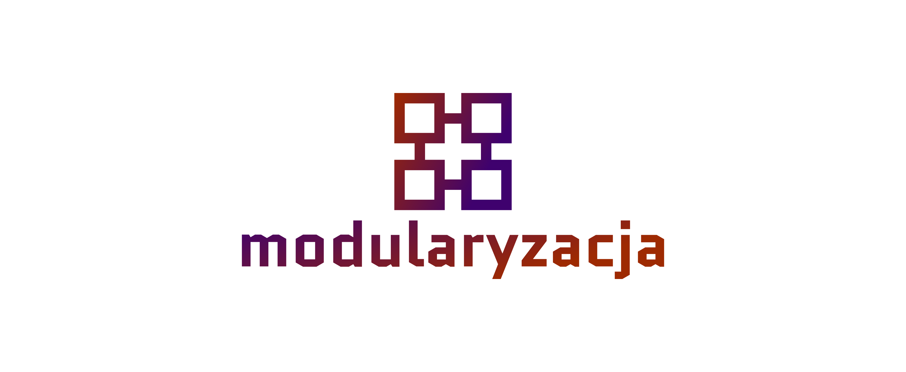
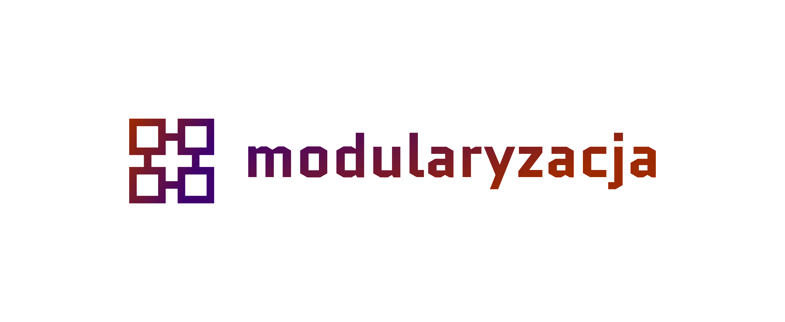
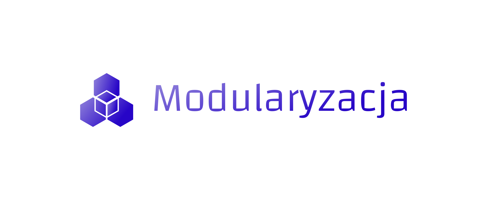
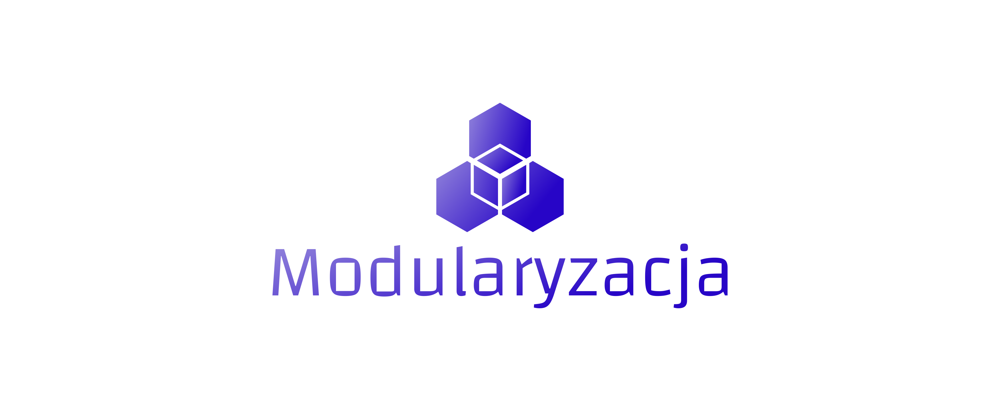

# Logotyp modularyzacja.pl
+ [Landing page: www.modularyzacja.pl](https://www.modularyzacja.pl/)
+ [Dokumentacja](https://docs.modularyzacja.pl/)
+ [Logotyp modularyzacja.pl](https://logo.modularyzacja.pl/)

# Font

        Font in use <a target="_blank" href="https://fonts.google.com/specimen/Quantico">Quantico-Bold</a> designed by
        <a target="_blank" href="http://www.madtype.com/">MADType</a>
        and licensed under
        <a target="_blank" href="http://scripts.sil.org/cms/scripts/page.php?site_id=nrsi&amp;id=OFL_web">Open Font License.</a>
          Icon Designed by
          <a target="_blank" href="https://thenounproject.com/cshekar36">Chandru</a>
          

## Font
  
    #3F016E, #9E2A01

## Background

    transparent

## Icon
     
    #9E2A01, #3F016E
    
    
## logo

## 1

## 2

          

# logo 2

## modularization.dev

blog

## Font

Font in use <a target="_blank" href="https://www.fontsquirrel.com/fonts/changa">Changa-Light</a> designed by
<a target="_blank" href="http://www.tipo.net.ar/">Eduardo Tunni</a>
and licensed under
<a target="_blank" href="http://scripts.sil.org/cms/scripts/page.php?site_id=nrsi&amp;id=OFL_web">Open Font License.</a>
  Icon Designed by
  <a target="_blank" href="https://thenounproject.com/mikicon">mikicon</a>
  
  
  
# Colors   

## Font
  
    #9284DB, #2705C7

## Background
    
    transparent

## Icon

    #9284DB, #2705C7

    
    
## logo

## 3

## 4

          

